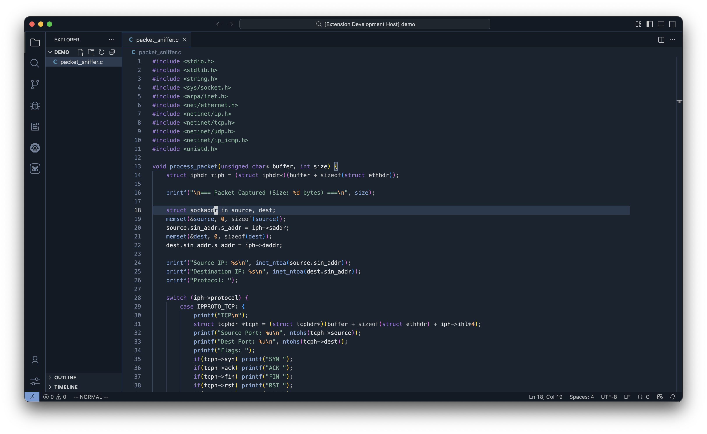
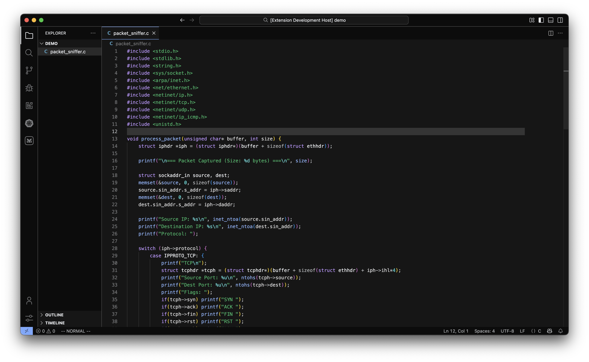
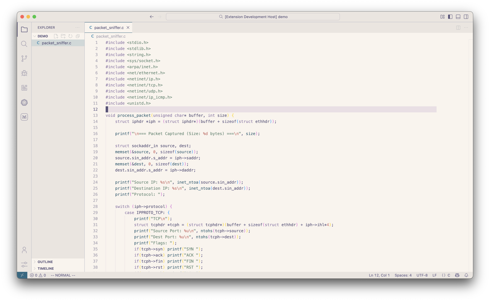
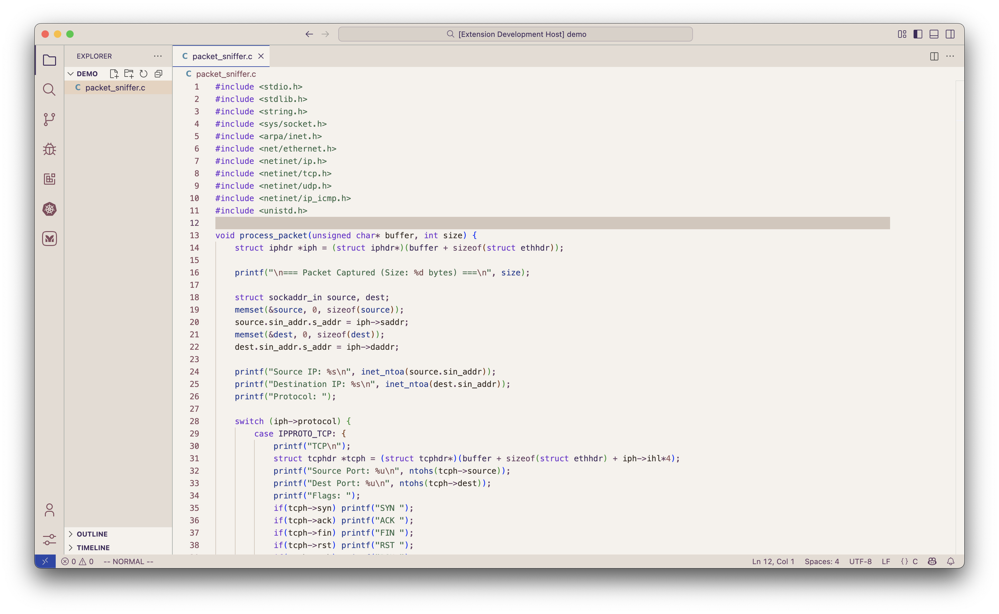
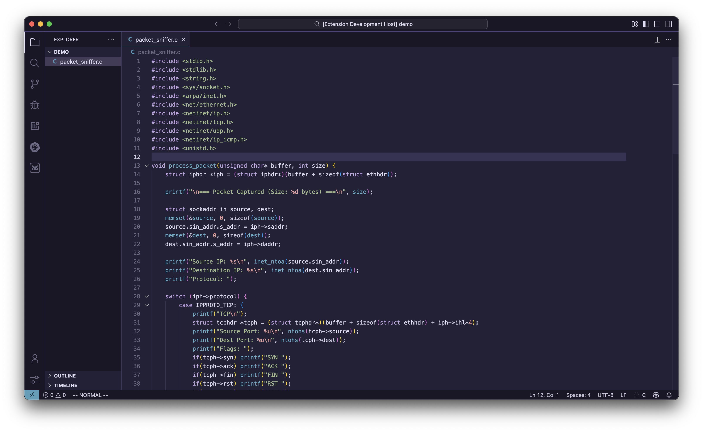
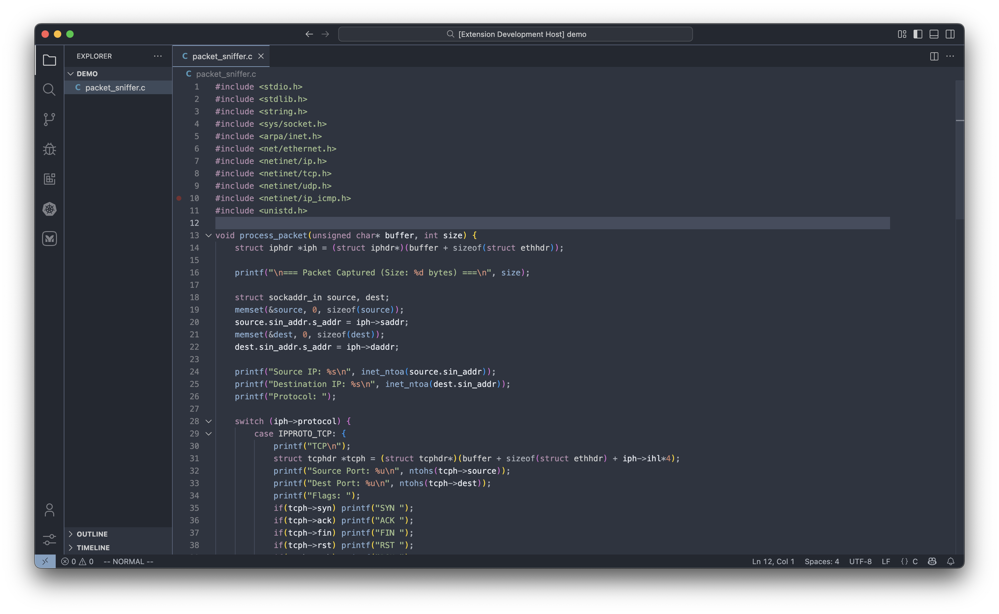
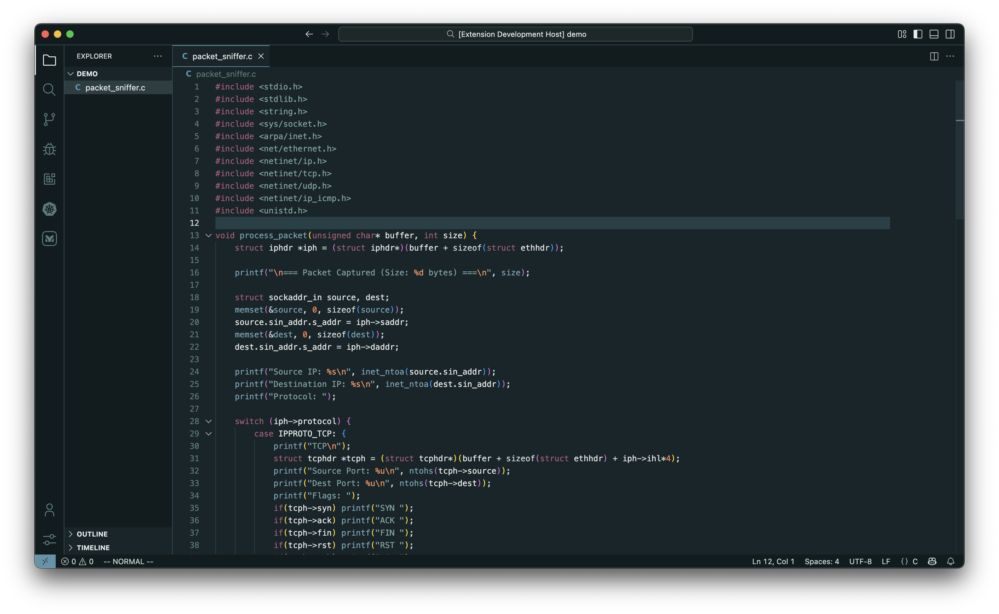

# Nightfox for VSCode

A highly customizable theme for VSCode, ported from [nightfox.nvim](https://github.com/EdenEast/nightfox.nvim).

## Themes

### Nightfox
A dark, medium contrast theme

### Carbonfox
A dark theme inspired by IBM Carbon

### Dawnfox
A light-medium contrast theme

### Dayfox
A light, high contrast theme

### Duskfox
A dark, muted theme

### Nordfox
A dark theme inspired by Nord

### Terafox
A dark, colorful theme

## Installation

1. Open VSCode
2. Go to Extensions (Ctrl+Shift+X / Cmd+Shift+X)
3. Search for "Nightfox"
4. Click Install
5. Go to Settings → Color Theme and select your preferred Nightfox variant

## Features

### Comprehensive UI Theming
All themes include complete styling for:

- Editor (background, foreground, selections, highlights)
- Status bar
- Activity bar
- Sidebar
- Tabs
- Panels
- Terminal (with proper ANSI colors)
- Git decorations
- Diff editor
- And much more!

### Semantic Token Support
Full semantic highlighting support with 41+ token definitions for enhanced syntax coloring.

## Credits

Original theme by [@EdenEast](https://github.com/EdenEast)

## License

MIT
